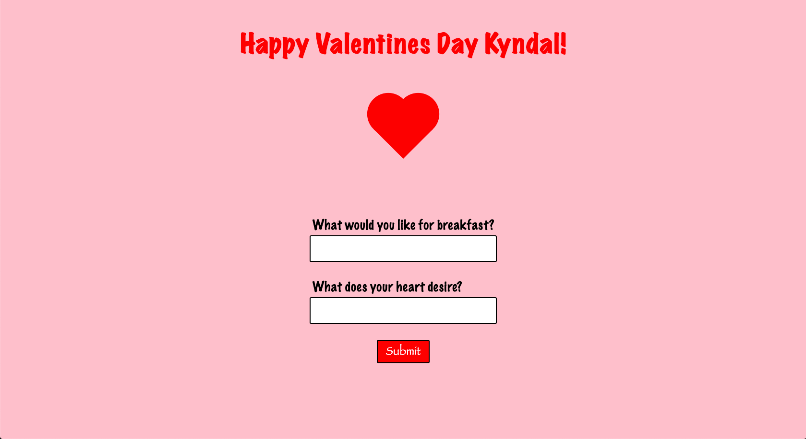

# Valentines Page :hearts:

This is a super simple web page I made in a few hours for my girlfriend. It features a form that asks a few questions and then has a submit button which emails me her requests for the day.



## Future goals

Due to how fast and last minute I built this, it doesn't have form validation. That would be nice to add in just to get some extra practice.

## Tools and Technologies

- JavaScript
- HTML
- CSS
- EmailJS API
- EmailJS SDK

## How to Use

This was a pretty big hit, so I welcome anyone to fork this and make it for their loved one. I didn't have a lot of time, so it does only run on localserver.

- What you're going to need to do is create an account with EmailJS and get an API key.
- You need to set up an email template as well. They have a tutorial in their documentation, so it's pretty easy.
- You'll have most of the code here, so you just need to enter in your API key in the code below, located in `index.html`.

```js
(function () {
  emailjs.init(""); // Insert key inside empty string
})();
```

\*\* If you fork this, please don't push your API to GitHub.

<br />

[](https://opensource.org/licenses/MIT)
